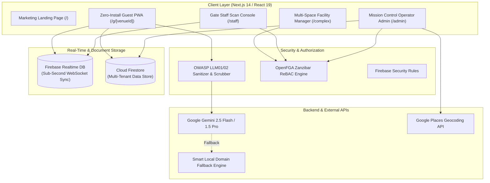

# 🏟️ VenueFlow: Real-Time Crowd Intelligence & Safety Platform

<div align="center">

[](https://developers.google.com/)
[](https://deepmind.google/technologies/gemini/)
[](https://nextjs.org/)
[](https://react.dev/)
[](https://firebase.google.com/)
[](https://openfga.dev/)
[](LICENSE)

<br/>

> **Transforming mega-events, stadiums, and multi-hall convention complexes with sub-second crowd density heatmaps, automated DIM-ICE safety protocols, Zanzibar-style ReBAC authorization, and multilingual Gemini AI navigation.**

[Live Demo](#-quick-start--local-setup) • [Architecture](#-system-architecture) • [Features](#-key-features--capabilities) • [AI Security & Evaluation](#-owasp-llm-security--promptfoo-evaluations) • [Setup Guide](#-quick-start--local-setup)

</div>

---

## 🌟 Hackathon Recognition: PromptWars Virtual

VenueFlow was developed and verified for **Google for Developers & Hack2Skill (H2S) PromptWars Virtual: Build with AI**, receiving a **Certificate of Appreciation** for successfully architecting and submitting a verified Generative AI solution for **Challenge 3**.

- **Event**: Google for Developers PromptWars Virtual (`Build with AI`)
- **Awardee**: Yashraj Rastogi
- **Verification ID**: `2026H2S06PWVCHL3-A00255`
- **Focus**: Real-time Generative AI crowd management, intelligent queue forecasting, and multi-tenant ReBAC facility safety.

---

## 🎯 The Problem VenueFlow Solves

1. **Crowd Congestion & Safety Hazards**: Unmanaged crowd surges at stadium gates, food courts, and egress bottlenecks create high-risk safety hazards. Without real-time density tracking, venue operators cannot detect crowd build-ups before they breach dangerous thresholds.
2. **Frustrated Guests & Lost Event Time**: Stadium attendees spend upwards of 30 minutes stuck in concession and restroom lines, missing key game moments or performances due to lack of visibility.
3. **Operator Blindspots & Multi-Tenant Silos**: Venue management teams traditionally rely on static security feeds and radio chatter. Large convention complexes (e.g. Bharat Mandapam, Javits Center) host multiple simultaneous events without unified cross-space density visibility.
4. **Accessibility Barriers**: Guests requiring step-free wheelchair routes frequently encounter unexpected congestion or stair-only pathways.

---

## 💡 How VenueFlow Solves It

```
                               ┌─────────────────────────────────────────────────────────┐
                               │                    VENUEFLOW PLATFORM                   │
                               └────────────────────────────┬────────────────────────────┘
                                                            │
         ┌──────────────────────────────────────────────────┼──────────────────────────────────────────────────┐
         │                                                  │                                                  │
┌────────┴──────────────┐                          ┌────────┴──────────────┐                          ┌────────┴──────────────┐
│  OPERATIONS & FACILITY│                          │   REAL-TIME ENGINE    │                          │      GUEST PWA        │
│    MISSION CONTROL    │                          │   & DIM-ICE SAFETY    │                          │   & GEMINI ASSISTANT  │
└────────┬──────────────┘                          └────────┬──────────────┘                          └────────┬──────────────┘
         │                                                  │                                                  │
 🏢 Google Places API                               ⚡ Firebase RTDB WebSocket                         🤖 Google Gemini 2.5/1.5
    Real lat/lng geocoding                             Sub-second zone telemetry                          Context-aware navigation
 🔐 OpenFGA ReBAC Auth                              🚨 DIM-ICE Crowd Protocol                          🌐 6-Language Translation
    Zanzibar relationship access                       Automated 85%/90% safety triggers                  ♿ Step-Free Accessible Paths
 🏛️ Multi-Space Complexes                            📊 Queue Wait Forecaster                           🛡️ OWASP LLM01 Sanitizer
```

---

## 🚀 Key Features & Capabilities

### 1. 🤖 Multilingual Gemini AI Navigation & Queue Forecasting
- **Context-Aware Assistance**: Powered by **Google Gemini 2.5 Flash / 1.5 Pro** with intelligent fallback to a local domain rule engine for 100% uptime.
- **Natural Language Q&A**: Answers attendee queries like *"Where is the shortest line for cold drinks near Gate 3?"* or *"How crowded is the East Club level?"*
- **Multilingual Support**: Real-time response in **English, Spanish, Portuguese, French, Hindi, and Arabic**.
- **Dynamic Queue Predictions**: Predicts 15-minute and 30-minute line trends based on event phase (*Doors Open, Pre-Game, Halftime, Egress*).

### 2. ⚡ Real-Time Crowd Density Heatmaps (Sub-Second Sync)
- **Interactive Dark-Matter Map**: Powered by Leaflet with dynamic color-coded SVG polygon overlays reflecting live density:
  - 🟢 **Green (0%–35%)**: Low density, swift movement.
  - 🟡 **Amber (36%–75%)**: Moderate activity.
  - 🔴 **Red (76%–100%)**: High congestion / bottleneck alert.
- **Firebase Realtime Database**: Synchronizes IoT sensor ticks, gate check-in counts, and staff updates to thousands of concurrent clients in <50ms.

### 3. 🚨 International DIM-ICE Automated Safety Protocol
- Implements the **DIM-ICE** crowd safety framework (*Direction, Information, Movement, Management, Infrastructure, Capacity, Entrances/Exits*).
- **Automated Threshold Triggers**:
  - **85% Capacity**: Triggers proactive staff re-route alerts.
  - **90% Capacity**: Initiates critical crowd re-allocation warnings and triggers immediate operator broadcast options.

### 4. 🏢 Real-World Stadium & Multi-Space Complex Importer
- **Google Maps Places API Integration**: Import any venue globally (e.g. *MetLife Stadium, Wembley, Madison Square Garden, Bharat Mandapam*) by name or URL.
- **Complex & Space Hierarchy**: Supports multi-hall complexes with independent spaces (Hall 1, Hall 2, Plenary Hall, Shared Atrium) with distinct organizers and centralized facility oversight.

### 5. 🔐 OpenFGA Zanzibar Relationship-Based Access Control (ReBAC)
- Fine-grained relationship authorization preventing unauthorized mutations:
  - `complex_admin`: Facility managers view all spaces and issue global emergency broadcasts.
  - `space_admin`: Event organizers manage only their assigned hall or session.
  - `staff`: On-duty gate staff scan tickets and report localized incidents.
  - `viewer`: Public attendees access live guest maps and safe routing.

### 6. 📱 Zero-Install Guest PWA & Accessible Routing
- Attendees scan a QR code at gate check-in—**no app download or registration required**.
- **Accessibility Mode**: Step-free wheelchair navigation avoiding stairs, escalators, and congested choke points.

---

## 🛡️ OWASP LLM Security & Promptfoo Evaluations

VenueFlow embeds rigorous security and quality standards directly into the AI pipeline:

- **OWASP LLM01 (Prompt Injection Guard)**: Sanitizes input queries via regex and heuristic safety filters (`src/lib/inputGuard.ts`), deflecting jailbreak attempts.
- **OWASP LLM02 (PII & Secret Scrubber)**: Automatically redacts internal tokens, credentials, and attendee PII from model completions.
- **OWASP LLM06 (Deterministic Action Gating)**: Mutations (emergency broadcasts, density overrides) require verified ReBAC credentials; LLM output can never execute administrative actions directly.
- **Promptfoo Quality Gate**: Continuous automated evaluation suite (`promptfoo.yaml`) testing:
  - Directional query accuracy
  - Safety & evacuation prompt response priority
  - Multi-language fidelity
  - Persona injection resistance (Pass rate ≥ **95%**)

```bash
# Run Promptfoo AI Quality Gate
npx promptfoo eval
```

---

## 🏗️ System Architecture



---

## 🛠️ Technology Stack

| Domain | Technology | Purpose |
|---|---|---|
| **Core Framework** | **Next.js 14 (App Router)** | Full-stack React 19 framework, SSR, RSC, and Edge API Routes |
| **Language & Typing** | **TypeScript 5** | Strict end-to-end type safety across client and server |
| **Styling & Design System**| **Vanilla CSS Tokens + Tailwind CSS** | "Mission Control" glassmorphism, dark palette, subtle glows |
| **Artificial Intelligence** | **Google Gemini 2.5 Flash & 1.5 Pro** | Multilingual assistant, wait time forecasting, smart navigation |
| **AI Quality & Security** | **Promptfoo + OWASP LLM Guards** | Heuristic prompt evaluation, injection sanitization, PII scrubber |
| **Realtime Telemetry** | **Firebase Realtime Database** | Sub-second crowd occupancy WebSocket synchronization |
| **Data Persistence** | **Cloud Firestore** | Multi-tenant orgs, venues, complex spaces, incidents |
| **Authorization (ReBAC)** | **OpenFGA SDK** | Zanzibar relationship-based access control for venues and spaces |
| **Geospatial & Mapping** | **Google Places API + Leaflet.js** | Venue lookup, coordinate resolution, interactive heatmaps |
| **Icons & Micro-Interactions**| **Lucide React** | High-density operational icons and indicators |

---

## 👥 Key User Journeys

### 1. The Attendee Journey
```
Gate QR Scan ➔ Mobile Web PWA (/g/[venueId]) ➔ Live Heatmap ➔ Shortest Queue Wait ➔ Ask Gemini AI
```
- Instantly view live line lengths for restrooms, concessions, and merchandise.
- Receive step-free accessible directions.
- Query Gemini AI in 6 languages for immediate assistance.

### 2. The Venue Operator Journey
```
Log In ➔ Select Venue / Complex ➔ Operator Command Center ➔ "Go Live" Simulation ➔ Emergency Broadcast
```
- Track real-time KPIs: Total Occupancy, Peak Zones, Open Incidents, Active Staff.
- Step through event phases (*Doors Open ➔ Pre-Game ➔ Halftime ➔ Egress*).
- Broadcast targeted safety notices to specific sections or the entire facility.

### 3. The Multi-Space Facility Manager Journey
```
Facility Overview (/complex/[complexId]) ➔ Space Breakdown ➔ Shared Atrium Flow ➔ Coordinated Safety Control
```
- Oversee multi-hall conventions (e.g., simultaneous conferences in separate halls).
- Monitor shared thoroughfares, elevators, and main exits to prevent cross-event bottlenecks.

---

## ⚡ Quick Start & Local Setup

### 1. Prerequisites
- **Node.js**: `v18.0.0` or higher
- **npm** or **yarn**
- A **Firebase Project** (Auth, Firestore, Realtime Database)
- A **Google Gemini API Key** ([Google AI Studio](https://aistudio.google.com/))
- *(Optional)* **Google Maps Places API Key**
- *(Optional)* **Docker** (for local OpenFGA ReBAC server)

### 2. Clone and Install Dependencies

```bash
git clone https://github.com/your-username/venueflow.git
cd venueflow
npm install
```

### 3. Configure Environment Variables
Create a `.env` file in the root directory:

```env
# Firebase Client SDK
NEXT_PUBLIC_FIREBASE_API_KEY="AIzaSy..."
NEXT_PUBLIC_FIREBASE_AUTH_DOMAIN="your-project.firebaseapp.com"
NEXT_PUBLIC_FIREBASE_PROJECT_ID="your-project-id"
NEXT_PUBLIC_FIREBASE_STORAGE_BUCKET="your-project.appspot.com"
NEXT_PUBLIC_FIREBASE_MESSAGING_SENDER_ID="1234567890"
NEXT_PUBLIC_FIREBASE_APP_ID="1:1234567890:web:abcde"
NEXT_PUBLIC_FIREBASE_DATABASE_URL="https://your-project-default-rtdb.firebaseio.com"

# Google Gemini AI Key
NEXT_PUBLIC_GEMINI_API_KEY="AIzaSy..."

# Google Maps Places API Key (Real-World Stadium Import)
GOOGLE_MAPS_API_KEY="AIzaSy..."
NEXT_PUBLIC_GOOGLE_MAPS_API_KEY="AIzaSy..."

# OpenFGA Authorization (Optional - Defaults to fail-safe fallback)
OPENFGA_API_URL="http://localhost:8080"
OPENFGA_STORE_ID=""
OPENFGA_MODEL_ID=""
```

### 4. (Optional) Run Local OpenFGA with Docker
```bash
docker run -d --name openfga -p 8080:8080 openfga/openfga run
```

### 5. Run the Development Server
```bash
npm run dev
```
Open [http://localhost:3000](http://localhost:3000) in your browser.

---

## 🧪 Verification & Automated Tests

```bash
# Run TypeScript compilation check
npx tsc --noEmit

# Run Jest unit and integration tests
npm test

# Run Promptfoo AI Evaluation suite
npx promptfoo eval

# Build production bundle
npm run build
```

---

## 📄 License

This project is open source and available under the [MIT License](LICENSE).

---

<div align="center">

**Built with ❤️ for Google for Developers PromptWars Virtual Hackathon.**  
*VenueFlow — Empowering Safer, Smarter, and Seamless Live Events Worldwide.*

</div>
